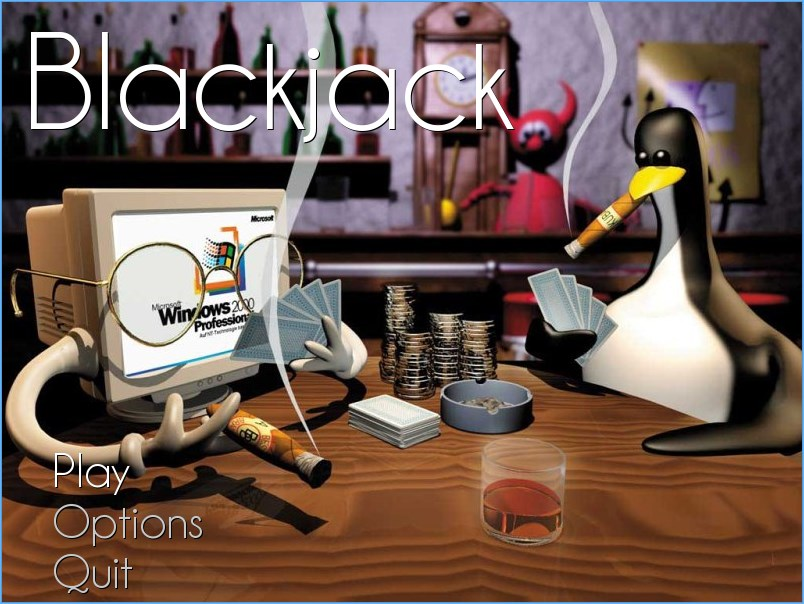
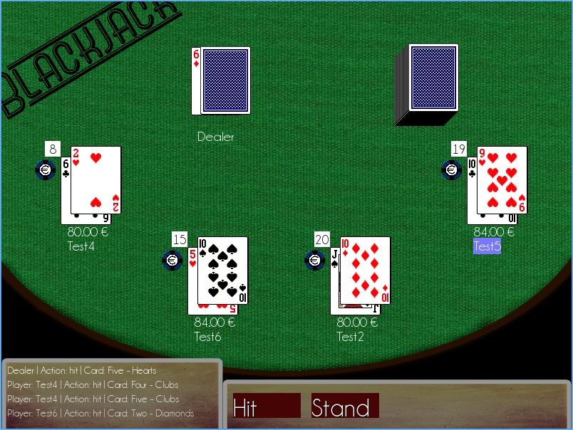

FEUP - MIEIC 2011/2012 - 1.º ano
--------------------------------

Blackjack
=========

Graphic library
---------------
[Allegro 5.0.6] - A game programming library

Other dependencies
------------------
[dirent.h] - `dirent API for Microsoft Visual Studio` by Toni Ronkko (included)

Resources credits
-----------------
* `Playing cards` sprite by [John Fitzgibbon]
* `Pack: game programmers soundset, blackjack` sounds by [milton]
* `Linux Games 1024x768 Wallpaper Don't Play Games on Windows` downloaded from [Wallpaper Linux]
* `Champagne & Limousines` font by [Lauren Thompson]
* `Chip 1` image downloaded from [freepatentsonline]

 [John Fitzgibbon]: http://www.jfitz.com/
 [milton]: http://www.freesound.org/people/milton./
 [Wallpaper Linux]: http://www.wallpaperlinux.com
 [Lauren Thompson]: http://www.nymFont.com
 [dirent.h]: http://www.softagalleria.net/dirent.php
 [Allegro 5.0.6]: http://alleg.sourceforge.net/
 [freepatentsonline]: http://www.freepatentsonline.com